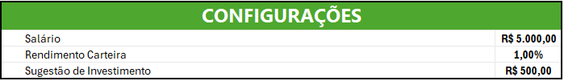
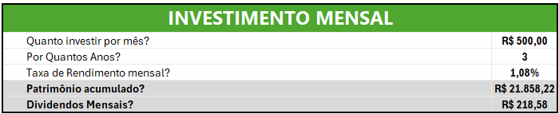
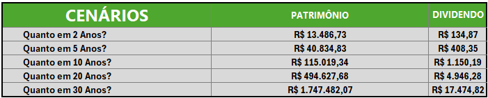
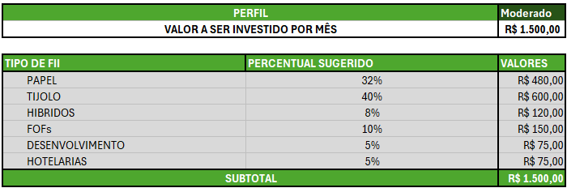
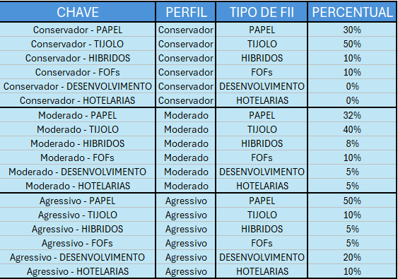
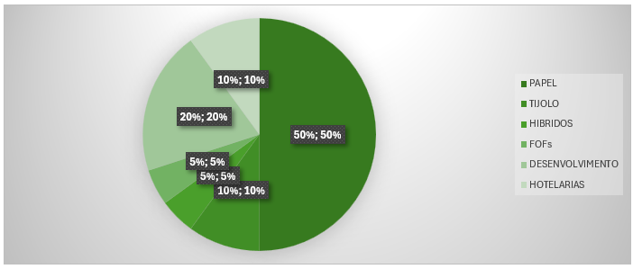
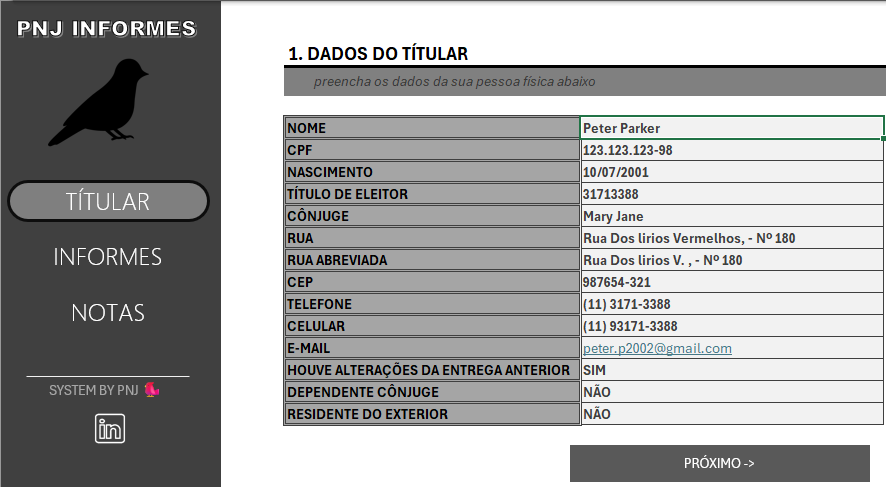
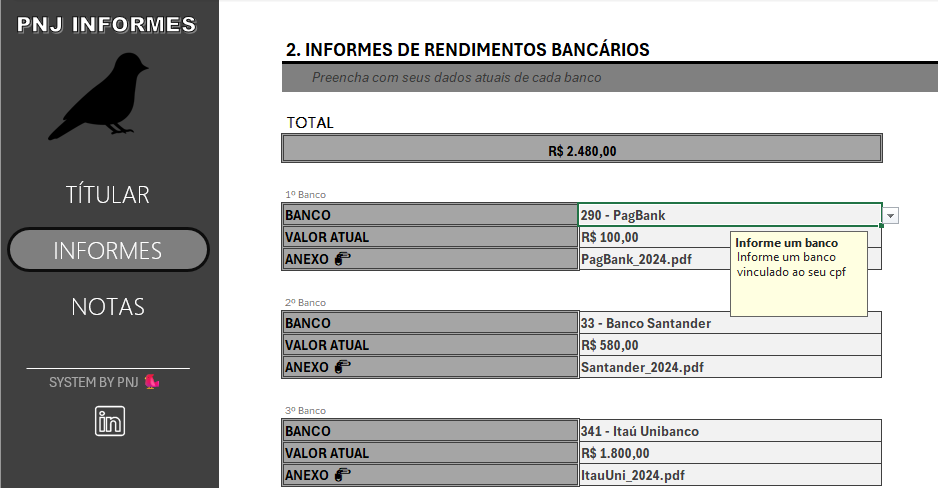
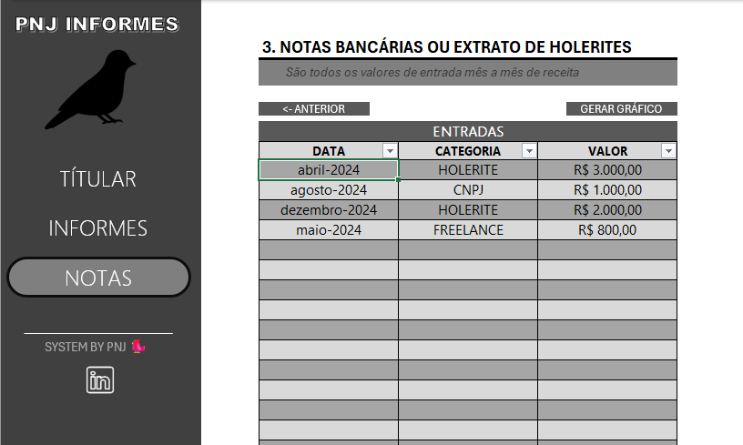
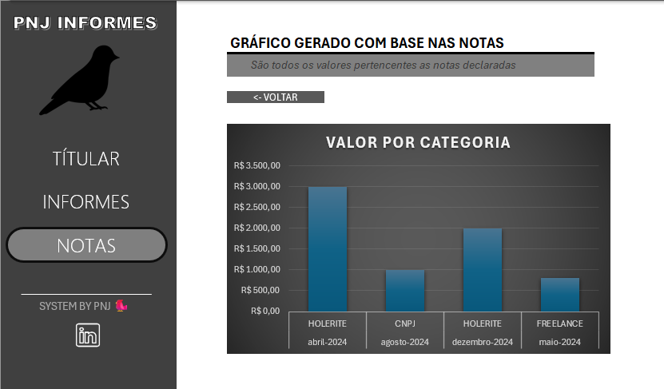

# Bootcamp-Excel - Santander

>Repositório dedicado aos estudos do Bootcamp de Excel com IA do Santander.

# Desafios de Projeto

Nesta seção estão todos os desafios de projeto propostos no bootcamp, juntamente com suas respectivas resoluções.

* [Desafio 1 : Planilha de Investimentos](#desafio-1)
* [Desafio 2 : Planilha moderna para Informe de Rendimentos](#desafio-2) 
* [Desafio 3 : Ainda não cheguei nele](#desafio-3) 

# Desafio 1

A partir de uma compreensão aprofundada sobre como os fundos imobiliários funcionam e as perguntas típicas dos investidores (quanto investir, por quanto tempo, taxa de rendimento, etc.), o desafio consiste em construir uma planilha que ajude o usuário a realizar essas simulações, auxiliando-o a tomar decisões mais informadas sobre seus investimentos. 

## Objetivos de aprendizagem

* Criar ferramentas de simulação de investimentos em Excel;
* Aplicar cálculos financeiros como rendimento mensal e cálculo de dividendos;
* Documentar processos técnicos de forma clara e estruturada; 
* Utilizar o GitHub como ferramenta para compartilhamento de documentação técnica. 

## Resolução do desafio

Com esta planilha, é possível configurar uma simulação para um perfil de usuário. Automaticamente, ela realiza os cálculos necessários para que possamos analisar qual perfil de investidor seria mais adequado, além de estimar o tempo ideal para investir com base no perfil e vontade de cada usuário.

### Tabela de Configuração

Aqui nessa tabela temos os campos editáveis: Salário, Rendimento Carteira, Sugestão de Investimento

### Investimento Mensal

Aqui nessa tabela temos as perguntas de negócio, com elas, automaticamente a planilha calcula o patrimônio acumulado bem como os dividendos mensais.

### Cenários

Nessa seção, com base no que foi preenchido na tabela anterior (Respondendo as perguntas de negócio), temos uma projeção pré-elaborada e calculada automaticamente em possíveis cenários para estudo do usuário.

### Perfil de investidor

Esta tabela permite alteração no campo de perfil, podemos definir como : Conservador, Moderado ou Agressivo. Além de também definir um valor para ser investido mensalmente. Após essas definições, será calculado automaticamente qual o valor mensal será investido em cada FII, o percentual a ser investido é coletado de uma tabela externa, a qual o usuário pode definir de acordo com os seus próprios critérios.

### Gráfico do Perfil de Investidor

Com base nos dados calculados, a planilha plotará um gráfico para análise de dados.

# Desafio 2

A proposta é construir um agregador de dados no qual o usuário possa controlar suas entradas de maneira eficiente e validada, com menus de navegação, validações automáticas e funcionalidades extras, como links rápidos. A solução será completamente construída no Excel, com recursos que tornam a ferramenta robusta, mas com uma interface amigável e prática.

## Objetivos de aprendizagem

* Aplicar os conceitos aprendidos em um ambiente prático;
* Documentar processos técnicos de forma clara e estruturada; 
* Utilizar o GitHub como ferramenta para compartilhamento de documentação técnica. 

## Resolução do desafio

Com esta planilha moderna, a qual podemos navegar através dela com itens clicáveis muito parecida com um app, podemos organizar de forma adequada os informes de rendimento para que facilite a declaração dos mesmos. Tudo organizado em um único lugar, com cálculo de totais e um gráfico gerado para que o usuário consiga observar os valores referente a cada categoria declarada de forma visual.

## Planilha para o Titular

Nesta aba, devemos preencher os dados do titular o qual fará a declaração do imposto de renda. Aqui, o usuário somente conseguirá alterar os campos onde ele deve preencher, pois o restante está protegido, como em todo o restante do projeto. O botão de navegação "Próximo", leva o usuário para a próxima página, porém, também é possível navegar através dos botões laterais.

## Planilha para os Informes

Aqui, o usuário deve preencher os dados atuais de cada banco, após realizar o preenchimento de todos os campos, poderemos vizualizar o campo total com o cálculo exato de todos os valores atuais, ou seja, tudo que o usuário possui em conta naquele momento. Nessa aba, além dos botões de navegação lateral, temos os botões "Próximo" e "Anterior", pelos quais é possível ir para a próxima aba ou voltar para a anterior.

## Planilha para as Notas

Nessa planilha, o usuário deve preencher todos os valores de entrada mês a mês, em categoria, foi definido que ele somente poderá escolher entre as 3 disponíveis definidas pela validação de dados do excel ( HOLERITE, CNPJ, FREELANCE), após preencher todos os dados, o usuário poderá clicar no botão "Gerar Gráfico" para que seja gerado um gráfico conforme os dados de entrada dele.

## Gráfico de notas

O gráfico contém as informações separadas por categorias, esse gráfico só pode ser acessado ao clicar no botão de gerar gráfico.

# Desafio 3